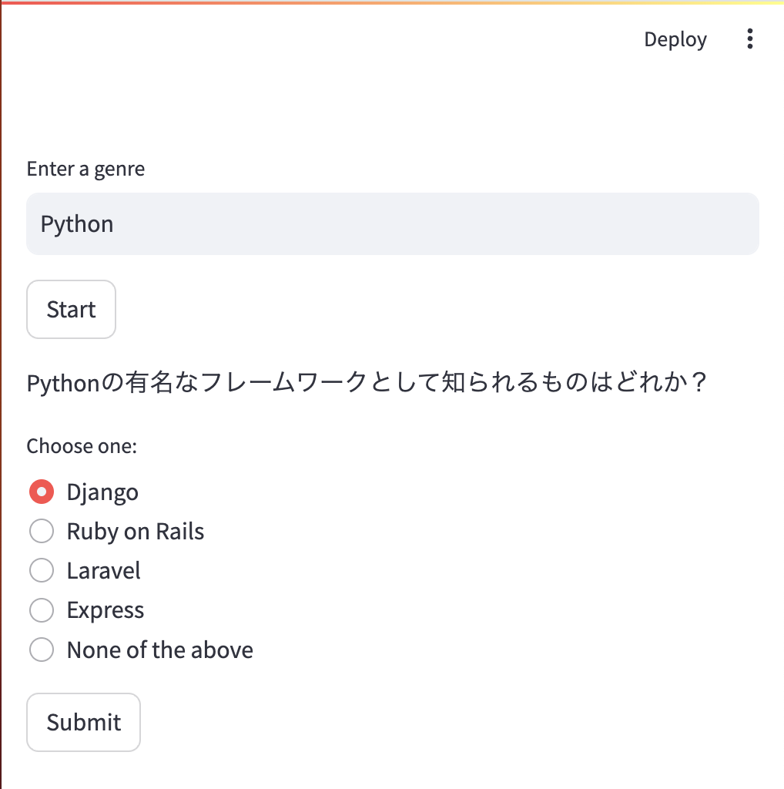

# 無限クイズ

指定されたジャンルのクイズを作成します。



## 注意事項

- このアプリケーションは、OpenAI の API を使用してクイズを作成しています。そのため、API の利用制限に注意してください。
- また、このアプリケーションは Streamlit を使用して作成されています。Streamlit は、Python でインタラクティブなウェブアプリケーションを簡単に作成することができるライブラリです。

## 実行方法

.env.example ファイルを.env にリネームします。

OpenAI の API キーを取得し、.env ファイルに記述してください。

```bash
OPENAI_API_KEY=your_api_key_here
```

仮想環境 venv を使う場合は、以下のコマンドを実行してください。

```bash
python3 -m venv .venv
source .venv/bin/activate
```

必要な依存関係をインストールするには、以下のコマンドを実行してください。

```bash
pip install -r requirements.txt
```

アプリケーションを実行するには、以下のコマンドを実行してください。

```bash
streamlit run app.py
```

## 使い方

- アプリケーションを開きます。
- "Enter a genre"というテキストボックスにジャンルを入力します。例えば、"Python"と入力します。
- "Start"ボタンをクリックします。すると、指定したジャンルに基づいてクイズが作成されます。
- 各質問に対して、選択肢から一つを選びます。もし、提供された選択肢が全て不適切だと思われる場合は、"None of the above"を選択します。
- "Submit"ボタンをクリックします。すると、あなたの回答が正しいかどうかが表示されます。
- "Next Question"ボタンをクリックします。すると、次の質問が表示されます。
- 全ての質問に回答した後、"Show Results"ボタンをクリックします。すると、あなたの最終スコアと各質問の正解が表示されます。
- "Retry"ボタンをクリックすると、クイズを再開することができます。

## 開発者向け情報

このアプリケーションは、以下の主要な関数で構成されています：

- `initialize_state(questions):` セッションの状態を初期化します。
- `display_question(question):` 質問と選択肢を表示します。
- `check_answer(answer, question):` 回答をチェックし、状態を更新します。
- `next_question(questions):` 次の質問に移動します。
- `display_final_score_and_answers():` 最終スコアと回答を表示します。
- `quiz(questions):` クイズのロジックを管理します。

このアプリケーションをカスタマイズするには、これらの関数を適宜修正してください。
